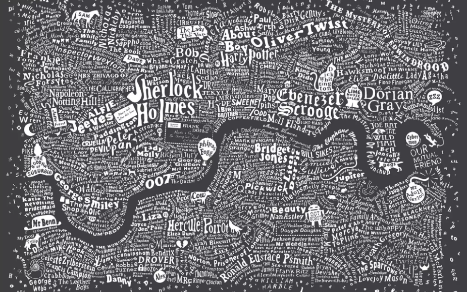

---

---





London, city of Sherlock, Harry Potter, Dorian Gray and many others...


Our client is a mid size real estate company trying to enter into airbnb business in London. Their new revenue model is to build or purchase flats and houses, renovate them and then list on the website. They also want to expand the business to Budapest Hungary soon.

Our task is to help them on the pricing issue by using the historical data publicly available online.

```{r message=FALSE, warning=FALSE}

library(doParallel)
library(ggplot2)
library(data.table)
library(caret)
library(glmnet)
library(dplyr)
library(ggthemes) #fivethirtyeight plots
library(skimr) #magical summaries
library(gridExtra) #combine plots
library(stargazer) #checked a few coeffs
library(knitr)
library(kableExtra) #html formating

registerDoParallel(cores = 4)
knitr::opts_chunk$set(warning = FALSE)

```

We need to get rid of some dublicates

```{r}

data <- fread("data/airbnbdata/airbnb_london_workfile.csv", stringsAsFactors = TRUE)

data[, c("neighbourhood_cleansed", "cancellation_policy", 
         "usd_price_day", "property_type", "room_type")  := NULL]

data[, neighbourhood_cleansed := NULL]

names(data)
data[, price := as.numeric(price)]

```

Since these properties will be renovated new listings, they will not have any review or review related scores. Later on we can build a new model for the existing ones. However, we will drop them for this initial study.

Cleaning of the properties will be outsourced to another company and it will be a standardized process. In the data when the cleaning fee is missing it is actually zero. And sometimes this feature is misused by the oweners. We will not use this feature as well.

```{r}
data[, c("n_review_scores_rating", "n_reviews_per_month", 
         "n_number_of_reviews", "n_days_since", "p_host_response_rate", "usd_cleaning_fee")  := NULL]
```

Do we have missing variables?

```{r}
sapply(data, function(x) sum(is.na(x))) %>%
  pander()
```

n_bathrooms (237), n_beds (167) have missing values.

We will use median value for the bathrooms assuming that 1 bathroom should be available.
Number of beds should be equal to the number of accommodate for the missing ones.

```{r}


data[, n_bathrooms := 
       ifelse(is.na(n_bathrooms), median(n_bathrooms, na.rm = T), n_bathrooms)]

data[, n_beds := 
       ifelse(is.na(n_beds), n_accommodates, n_beds)]

#a few observations with strange prices. Illogical and outscope numbers create noise to our business question.
data <- data[data$price > 10, ]
data <- data[data$price < 700, ]

```

```{r, results="hide"}
#Below is the small gadget i wrote to study my variables in detail.
sapply(data, function(x) if (class(x) == 'factor') {unique(x)
  } else if (class(x) != 'factor') {skim(x)})
```


```{r, results="hide"}
#take another look 
glimpse(data)
```

How is the average price changing district by district?

```{r}
data[, .(count = .N, 
         avg_price = round(mean(price)),
         median_price = round(median(price)),
         min = min(price),
         max = max(price)), 
                 by = f_neighbourhood_cleansed][order(-avg_price)] %>%
  filter(count > 1000)

```

Now time to select a random district... We will select a random district and compare it with the entire London. This will also help us to analyze several different districts without changing the code. However, I will set a seed below for reproducability of this one

```{r}
#a dplyr way...
set.seed(22) #reproduce
selection_table <- data %>%
                      group_by(f_neighbourhood_cleansed) %>%
                      tally() %>%
                      filter(n > 1000) %>%
                      arrange(desc(n))


lottery_winner <- as.vector(sample(selection_table$f_neighbourhood_cleansed, 1))
lottery_winner
```

Hello My District... This is the area where **Sherlock Holmes** lived.

```{r}
district <- data %>%
              filter(f_neighbourhood_cleansed == lottery_winner)

```


```{r}
## Distribution of price by type
plot1 <- ggplot(data, aes(price, fill = f_room_type)) + 
         ggtitle("Price Density, London") +
         geom_density(alpha = 0.3) + theme_fivethirtyeight()

## Boxplot of price by room type
plot2 <- ggplot(data, aes(f_room_type, price)) + 
         ggtitle("Price in London") +
         geom_boxplot()+ theme_fivethirtyeight()

plot3 <- ggplot(district, aes(price, fill = f_room_type)) + 
         ggtitle("Price Density, District") +
         geom_density(alpha = 0.3) + theme_fivethirtyeight()

## Boxplot of price by room type
plot4 <- ggplot(district, aes(f_room_type, price)) + 
         ggtitle("Price in District") +
         geom_boxplot()+ theme_fivethirtyeight()

grid.arrange(plot1, plot2, plot3, plot4, ncol=2, nrow=2)
```

Distributions are similar. We see the skewness to the right and how price changes by property type. 


```{r}

plot5 <- ggplot(data, aes(x = factor(n_accommodates), y = price, fill = factor(f_property_type))) +
         geom_boxplot(alpha=0.8) +
         scale_x_discrete(name = "Accomodate Persons") +
         ggtitle("Price Per Accommodate in London") + theme_fivethirtyeight()

plot6 <- ggplot(data = data) +
         geom_bar(data = data,
         aes(x = factor(n_accommodates),
         color = f_room_type, fill = f_room_type)) +
         ggtitle("# Accomodations and property types London") +
         xlab('Accommodates') + theme_fivethirtyeight()

grid.arrange(plot5, plot6, nrow=2)
```

Accommodate is an important feature we will need to pay attention.

There is a wide range of price. So there must be some factors which make differences. Now I will leave the path and enter into a random forest to see which variables it picks. 

This will be a heuristic approach. Because I am lacking the domain knowledge in this business, I will use random forest to pick the most important (highly likely) variables for me. It is probabilistic, however, it can be a better start than knowing nothing at all.

```{r}
# Fit random forest
RFtrainControl <- trainControl(method = "cv", 
                               number = 2, 
                               verboseIter = TRUE)
set.seed(1234)
RFmodel <- train(
  price ~ .,
  tuneLength = 1,
  data = district, 
  method = 'ranger',
  na.action = na.omit,
  importance = 'impurity',
  trControl = RFtrainControl)

```

```{r}
varImp(RFmodel)
```

Accommodates looks like the most important variable indeed. 
And for example being kid friendly might have some effect. 
Below we can see its plot, error bars added to emphasise the level of uncertainty.

```{r, fig.width=9,fig.height=2, message=FALSE, warning=FALSE}
library(psych)

stats <- describeBy(data$price,list(data$f_room_type,data$d_familykidfriendly), mat=TRUE,digits=2)
stats$se = stats$sd/sqrt(stats$n)
names(stats)[names(stats) == 'group1'] = 'Type'
names(stats)[names(stats) == 'group2'] = 'KidFriendly'

stats_2 <- describeBy(data$price,list(data$f_room_type,data$d_tv), mat=TRUE,digits=2)
stats_2$se = stats_2$sd/sqrt(stats_2$n)
names(stats_2)[names(stats_2) == 'group1'] = 'Type'
names(stats_2)[names(stats_2) == 'group2'] = 'TV'


limits = aes(ymax = mean + (1.96*se), ymin=mean - (1.96*se))
dodge = position_dodge(width=0.9)

apatheme=theme_bw()+
  theme(panel.grid.major=element_blank(),
        panel.grid.minor=element_blank(),
        panel.border=element_blank(),
        axis.line=element_line())

p7 <- ggplot(stats, aes(x = Type, y = mean, fill = KidFriendly))+
  geom_bar(stat='identity', position=dodge)+
  geom_errorbar(limits, position=dodge, width=0.25)+
  ylab('Mean Price')+
  theme_fivethirtyeight() + apatheme +
  scale_fill_grey()

p8<- ggplot(stats_2, aes(x = Type, y = mean, fill = TV))+
  geom_bar(stat='identity', position=dodge)+
  geom_errorbar(limits, position=dodge, width=0.25)+
  ylab('Mean Price')+
  theme_fivethirtyeight() + apatheme +
  scale_fill_grey()

grid.arrange(p7, p8, ncol=2)

```

Playing our card to be-kid-friendly, we can increase our profits. Maybe the families with small kids are ready to pay more than young couples and singles. We will try these interactions during modeling.

```{r}
london <- data[complete.cases(data)]
district <- data.table(district)
district <- district[complete.cases(district)]

```

partitioning to training and test sets
```{r}
training_ratio <- 0.7

set.seed(1234)
train_indices <- createDataPartition(y = london[["price"]],
                                     times = 1,
                                     p = training_ratio,
                                     list = FALSE)
london_train <- london[train_indices, ]
london_test <- london[-train_indices, ]
```

```{r}
set.seed(1234)
train_indices <- createDataPartition(y = district[["price"]],
                                     times = 1,
                                     p = training_ratio,
                                     list = FALSE)

district_train <- district[train_indices, ]
district_test <- district[-train_indices, ]
```

```{r}
fit_control <- trainControl(method = "cv", number = 10)
```

###1) Linear 1
```{r}
set.seed(1234) # The most simple one for benchmarking or comparing...
model_1_london <- train(price ~ n_accommodates, 
                   data = london_train, 
                   method = "lm", 
                   trControl = fit_control)
```

```{r}
set.seed(1234)
model_1_district <- train(price ~ n_accommodates, 
                   data = district_train, 
                   method = "lm", 
                   trControl = fit_control)
```

###2) Linear 2
```{r}
set.seed(1234) # Adding some more variables from our exploration to see the effects
model_2_london <- train(price ~ n_accommodates + n_beds + f_room_type + 
                         n_minimum_nights + n_guests_included + n_bathrooms, 
                   data = london_train, 
                   method = "lm", 
                   trControl = fit_control)
```

```{r}
set.seed(1234) #
model_2_district <- train(price ~ n_accommodates + n_beds + f_room_type + 
                         n_minimum_nights + n_guests_included + n_bathrooms, 
                   data = district_train, 
                   method = "lm", 
                   trControl = fit_control)

```

###3) Linear 3
```{r}
set.seed(1234) # load the variables from random forest varible importance list and some interactions and polynomials
model_3_london <- train(price ~ n_accommodates + n_beds + f_room_type + n_bathrooms + n_guests_included +
                          n_minimum_nights + f_property_type + n_extra_people + f_cancellation_policy +
                          d_tv + d_familykidfriendly + d_cabletv + d_laptopfriendlyworkspace + d_dryer +
                          d_elevatorinbuilding + d_indoorfireplace  + d_buzzerwirelessintercom 
                          + d_carbonmonoxidedetector + d_hangers + d_internet +
                          n_accommodates^2 + n_beds^2 + f_property_type*d_familykidfriendly +
                          n_accommodates*d_tv + n_accommodates*d_familykidfriendly + n_accommodates*d_cabletv,
                   data = london_train, 
                   method = "lm", 
                   trControl = fit_control)
```


```{r}
set.seed(1234) #load the variables from random forest varible importance list and some interactions and polynomials
model_3_district <- train(price ~ n_accommodates + n_beds + f_room_type + n_bathrooms + n_guests_included +
                          n_minimum_nights + f_property_type + n_extra_people + f_cancellation_policy +
                          d_tv + d_familykidfriendly + d_cabletv + d_laptopfriendlyworkspace + d_dryer +
                          d_elevatorinbuilding + d_indoorfireplace  + d_buzzerwirelessintercom 
                          + d_carbonmonoxidedetector + d_hangers + d_internet +
                          n_accommodates^2 + n_beds^2 + f_property_type*d_familykidfriendly +
                          n_accommodates*d_tv + n_accommodates*d_familykidfriendly + n_accommodates*d_cabletv,
                   data = district_train, 
                   method = "lm", 
                   trControl = fit_control)
```


###4) LASSO with super low lambdas, targeting lower RMSE score here:
```{r}
tune_grid <- expand.grid("alpha" = 1,
                         "lambda" = seq(0.028, 0.036, 0.001))

set.seed(1234) # lasso.
model_4_london <- train(price ~ .,
                   data = london_train, 
                   method = "glmnet", 
                   trControl = fit_control,
                   metric = "RMSE",
                   preProcess = c("center","scale"),
                   tuneGrid = tune_grid,
                   tuneLength=3)

```

```{r}
tune_grid <- expand.grid("alpha" = 1,
                         "lambda" = seq(0.25, 0.35, 0.01))

set.seed(1234) # lasso
model_4_district <- train(price ~ .,
                   data = district_train, 
                   method = "glmnet", 
                   trControl = fit_control,
                   metric = "RMSE",
                   tuneGrid = tune_grid)
```

Cross Validation RMSEs
```{r}
model_1_london_rmse_cv <- model_1_london$results[["RMSE"]]
model_2_london_rmse_cv <- model_2_london$results[["RMSE"]]
model_3_london_rmse_cv <- model_3_london$results[["RMSE"]]
model_4_london_rmse_cv <- min(model_4_london$results[["RMSE"]])

model_1_district_rmse_cv <- model_1_district$results[["RMSE"]]
model_2_district_rmse_cv <- model_2_district$results[["RMSE"]]
model_3_district_rmse_cv <- model_3_district$results[["RMSE"]]
model_4_district_rmse_cv <- min(model_4_district$results[["RMSE"]])

```

How do these models perform on test sets and the full sample? I have run all the predictions and listed them in a table below. These are RMSE scores:

```{r, echo=FALSE}
#london model predictions on full set
model_1_london_pred <- predict(model_1_london, newdata = london)
model_2_london_pred <- predict(model_2_london, newdata = london)
model_3_london_pred <- predict(model_3_london, newdata = london)
model_4_london_pred <- predict(model_4_london, newdata = london)

#london model rmse on full set
model_1_london_rmse_full <- RMSE(model_1_london_pred, london$price)
model_2_london_rmse_full <- RMSE(model_2_london_pred, london$price)
model_3_london_rmse_full <- RMSE(model_3_london_pred, london$price)
model_4_london_rmse_full <- RMSE(model_4_london_pred, london$price)

#district model predictions on full set
model_1_district_pred <- predict(model_1_district, newdata = london)
model_2_district_pred <- predict(model_2_district, newdata = london)
model_3_district_pred <- predict(model_3_district, newdata = london)
model_4_district_pred <- predict(model_4_district, newdata = london)

#district model rmse on full set
model_1_district_rmse_full <- RMSE(model_1_district_pred, london$price)
model_2_district_rmse_full <- RMSE(model_2_district_pred, london$price)
model_3_district_rmse_full <- RMSE(model_3_district_pred, london$price)
model_4_district_rmse_full <- RMSE(model_4_district_pred, london$price)

###################################

#london model predictions on test set
model_1_london_pred_test <- predict(model_1_london, newdata = london_test)
model_2_london_pred_test <- predict(model_2_london, newdata = london_test)
model_3_london_pred_test <- predict(model_3_london, newdata = london_test)
model_4_london_pred_test <- predict(model_4_london, newdata = london_test)

#london model rmse on test set
model_1_london_rmse_test <- RMSE(model_1_london_pred_test, london_test$price)
model_2_london_rmse_test <- RMSE(model_2_london_pred_test, london_test$price)
model_3_london_rmse_test <- RMSE(model_3_london_pred_test, london_test$price)
model_4_london_rmse_test <- RMSE(model_4_london_pred_test, london_test$price)

#district model predictions on test set
model_1_district_pred_test <- predict(model_1_district, newdata = district_test)
model_2_district_pred_test <- predict(model_2_district, newdata = district_test)
model_3_district_pred_test <- predict(model_3_district, newdata = district_test)
model_4_district_pred_test <- predict(model_4_district, newdata = district_test)

#district model rmse on test set
model_1_district_rmse_test <- RMSE(model_1_district_pred_test, district_test$price)
model_2_district_rmse_test <- RMSE(model_2_district_pred_test, district_test$price)
model_3_district_rmse_test <- RMSE(model_3_district_pred_test, district_test$price)
model_4_district_rmse_test <- RMSE(model_4_district_pred_test, district_test$price)

```

```{r, echo=FALSE}
frame <- matrix(c( 1, model_1_london_rmse_cv, 
                   model_1_london_rmse_full, 
                   model_1_london_rmse_test, 
                   model_1_district_rmse_cv, 
                   model_1_district_rmse_full, 
                   model_1_district_rmse_test,

                   2, model_2_london_rmse_cv, 
                   model_2_london_rmse_full,
                   model_2_london_rmse_test, 
                   model_2_district_rmse_cv, 
                   model_2_district_rmse_full, 
                   model_2_district_rmse_test,
                   
                   3, model_3_london_rmse_cv, 
                   model_3_london_rmse_full, 
                   model_3_london_rmse_test, 
                   model_3_district_rmse_cv, 
                   model_3_district_rmse_full, 
                   model_3_district_rmse_test,
                   
                   4, model_4_london_rmse_cv, 
                   model_4_london_rmse_full,
                   model_4_london_rmse_test, 
                   model_4_district_rmse_cv, 
                   model_4_district_rmse_full, 
                   model_4_district_rmse_test
                   ), 
                   
                  nrow= 4, byrow= TRUE)

colnames(frame) <- c('model', 'London CV', "London FULL", "London Test", 
                              "District CV", "District FULL", "District Test")

result_table <- data.frame(frame)

#kable(result_table, digits = 2, format = "html", align = 'c')

# knitr::kable(
#   result_table, booktabs = TRUE,
#   caption = 'A table of RMSE results'
# )

pander(result_table)
```

lasso (number 4) is giving better RMSE results on test set, for both London and the district. I would use Lasso for both of them.

District is a representative sample of London. Price is distributed very similarly. However, when we try the model of the district to predict the entire London, we do a poor job. District is a small sample and its model cant capture the variation for the entire city.

Cross Validation and Test Set RMSE scores are almost identical. It is logical since the process of CV is to create several test sets and they are coming from the same data using random sampling.

We would use these models also for predicting 2018 prices for London. Because we think that 2018 will be similar to 2017. On the other hand Budapest prices are very different. I wouldn't predict the price by using a model from London. It will overshoot first of all... Having said that, I can use the experience I gained from London to build new models for other cities. Especially during the process of picking the right coefficients or variables.


In my second iteration I would also use one of the variables I dropped at the beginning which are related to reviews. Probably reviews and review scores would have some effect if engineered carefully. Reviews, review scores are more touching to behavioural science and tend to contain more noise.

I would also be curious about how rating scores change over time.


### CART and Random Forest Results

Now we can grow a tree and see its results.

```{r}
trctrl <- trainControl(method = "cv", number = 10)

set.seed(1234)
model_tree1_london <- train(price ~ ., 
                     
                     data = london_train, method = "rpart",
                     metric = "RMSE",
                     trControl=trctrl,
                     tuneLength = 20,
                     tuneGrid = data.frame(cp=seq(0.001, 0.01, 0.01))) #0.00001, 0.001, 0.0001
model_tree1_london

```

```{r}
postResample(london_test$price, predict(model_tree1_london, newdata = london_test, type = "raw"))
```

A regression tree is giving quite promising results for the london test set. RMSE is already as good as the Lasso.

Lets get the result also for our district:

```{r}
trctrl <- trainControl(method = "cv", number = 10)

set.seed(1234)
model_tree1_district <- train(price ~ ., 
                     
                     data = district_train, method = "rpart",
                     metric = "RMSE",
                     trControl=trctrl,
                     tuneLength = 20,
                     tuneGrid = data.frame(cp=seq(0.003, 0.0036, 0.0001)))
model_tree1_district
```
Here we can see RMSE change vs complexity parameter of the tree
```{r, fig.width=3,fig.height=2}
plot(model_tree1_district)
```
```{r}
postResample(district_test$price, predict(model_tree1_district, newdata = district_test, type = "raw"))
```

Again the tree is doing almost as good as lasso. 

```{r}
# Fit random forest to district
RFtrainControl <- trainControl(method = "cv", 
                               number = 2, 
                               verboseIter = TRUE)
set.seed(1234)
model_RF_district <- train(
  price ~ .,
  tuneLength = 1,
  data = district_train, 
  method = 'ranger',
  na.action = na.omit,
  importance = 'impurity',
  trControl = RFtrainControl)

RFmodel
```
```{r}
postResample(district_test$price, predict(model_RF_district, newdata = district_test, type = "raw"))
```


This Random Forest RMSE is the best so far. It is giving better results than the others. However, it is difficult to explain it to our business stakeholders. 

We can plot the trees and explain the linear regression coeffs more effectively to the people. RF model wont enjoy that much clarity. That's because I would prefer to tweak and play with my linear models and lasso with an objective to get closer to the Random Forest.

Later on I can try the same coeffs to Budapest. I would use the model we built for entire London to work on Budapest. The model we used for the district is less likely to be generalized.

I would like to close this small paper with the plot below showing Lasso Model predictions to show the errors. Predictions are getting worse and worse as the real rental price increases: Predicting less than it is. Similar trend is visible for the predictions of other models as well.

```{r, fig.width=9,fig.height=3}
ggplot(london_test, aes(price, model_4_london_pred_test - price, col = f_room_type)) + geom_point() +
  geom_abline(intercept = 0, slope = 0) + theme_fivethirtyeight()

```


