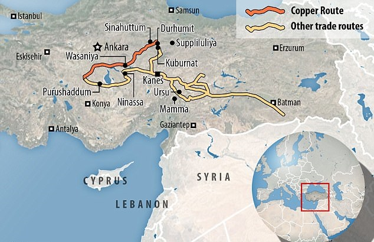

---

---

<b>2018.27.02 </b>

###I analyze a large dataset of commercial records produced by Assyrian merchants in the 19th Century BCE...

[this is how the language sounded like...](https://soundcloud.com/user444756202/the-epic-of-gilgames-standard-version-tablet-xi-lines-1-163-read-by-karl-hecker "from Gilgamesh")

<b>2018.01.03 </b>

###And this is how it looked like:

<b>2018.02.03 </b>

###Some smart people decrypted these languages. For example

nu ninda en e-iz-za-te-ni </n>
<b>wa-a-tar</b>-ma e-ku-ut-te-ni

Translation:

"Now you will eat bread and drink water"

wa-a-tar means water. ninda means bread. Quite familiar isn't it?

###Records in our database look like this:

###An escavated tablet looks like this:

###These people lived 4000 years ago. And this is where they lived:

