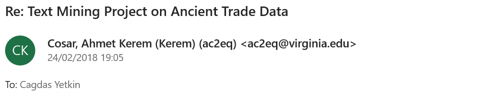

---

---

##Chapter 1
###Introuction to Unstructure Text Data Analysis using LDA

When we are dealing with a collection of documents, such as all the text files from the Bronze Age Assyrian civilization, we may want to divide them into natural groups like "Trade" and "Warfare".

LDA is a popular method for fitting such models:
(a) It considers each document as a mixture of topics
(b) And each topic as a mixture of words. 

What does this mean? 

Let's say we have a 2 topic LDA model on ancient Assyrian texts. The first text script has a probability of 85% coming from
topic 1, and a probability of 15% coming from topic 2 (a). 

In "Warfare" and "Trade" example above, the most frequent words in "warfare" topic can be: ["massacre", "head", "enslave", "burn"],
while "Trade" topic may contain: ["amphora", "cargo", "pay", "ship"] (b).

LDA is a method estimating both of these (a and b) at the same time.
It is important to realize that this is an unsupervised method. We don't have these "Trade" and "Warfare" labels at the beginning. And the analyst decides how many topics there will be. 

###How should a a full tidy text analysis look like?

The overall objective is to process our raw data and to arrive at some meaningful insights. The end results are visualized using libraries like ggplot, igrapgh, ggraph. We handle the data wrangling and processing part using a “tidy” approach (heavily using tidyverse, regexp). Converting to and from non-tidy formats is a crucial skill to have.

As a first step it makes sense to calculate some word frequencies by simple counts and tf_idf. It can be pseudo code as follows:

```{r}
# get_data() & preprocess() %>%
# unnest_tokens() >> tidy text %>%
# anti_join(stopwords) %>%
# summarize, group_by, count(words), tf-idf %>%
# visualize()
```


Next natural step can be getting some sentiments from the collection of texts we are looking into. Are these negative or positive texts for example? Or which parts or chapters have what kind of sentiments. A summary pseudo code can be:

```{r}
# decide/find the lexicons you want to use %>%
# inner_join(lexicon) %>%
# group_by and do summaries %>%
# visualize()
```


We might also want to look at into ngrams which can capture two or three words in a row and do frequency and sentiment analysis on them. Pseudo code can go like:

```{r}
# unnest_tokens using ngram %>%
# filtering where needed and then apply tf-idf %>%
# visualize %>%
# apply sentiment analysis on ngram this time%>%
# visualize()
```


In some certain scenarios, we might be interested in topic modeling where we want to divide our text into natural groups. This can be about feeding all the articles from a newspaper into the algorithm, give how many topics we want as an input and expect the machine to give output topics related to “economy”, “politics” and “sports”. It follows a high-level pseudo code:

```{r}
# do document term matrix %>%
# apply LDA to do get topics %>%
# work on your topics using dplyr tidyr as usual, tidy model %>%
# visualize()
```

###How does this work in practice? We will do a short tidy text analysis where we extract topics and explain why they are good or bad:

```{r, warning=FALSE, message=FALSE}
library(stringr)
library(dplyr)
library(tidyr)
library(tidytext)
library(ggplot2)
library(ggthemes)
library(gridExtra)
library(topicmodels)
library(tm)
```


We will load 2 books from the Game of Thrones series, The Lord of the Rings series and The Hobbit. These are fantasy fiction novels. They all talk about lords, ladies, kings, prices, wars etc. We will see how we can create two natural groups from this collection.

The underlying philosophy is to be able to use this LDA method even when we are not sure what we are looking for.

However, in this below setup we already know that we have 2 authors only, and thus, 2 natural groups. This can get confusing and even useless if we try to extract 4-5 topics out of them.

```{r, warning=FALSE}
#load the books
GoT2 <- readLines("data/textdata/GoT2.txt") %>%
  data_frame() %>%
  mutate(title = "A Clash of Kings") 

GoT3 <- readLines("data/textdata/GoT3.txt") %>%
  data_frame() %>%
  mutate(title = "A Storm of Swords")

lotr <- readLines("data/textdata/lotr.txt") %>% #it contains the entire Lord of The Rings series
  data_frame() %>%
  mutate(title = "Lord of the Rings")

hobbit <- readLines("data/textdata/hobbit.txt") %>%
  data_frame() %>%
  mutate(title = "The Hobbit")

books <- bind_rows(list(GoT2, GoT3, lotr, hobbit)) 
colnames(books) <- c("text", "title")

my_stop_words <- data_frame(word = c('page'))

```


```{r}
# divide into documents, each representing one chapter
by_chapter <- books %>%
  group_by(title) %>%
  mutate(chapter = cumsum(str_detect(text, regex("^chapter ", ignore_case = TRUE)))) %>%
  ungroup() %>%
  filter(chapter > 0) %>%
  unite(document, title, chapter)
```


```{r, warning=FALSE, message=FALSE}
# split into words
by_chapter_word <- by_chapter %>%
  unnest_tokens(word, text)

# find document-word counts
word_counts <- by_chapter_word %>%
  anti_join(stop_words) %>%
  anti_join(my_stop_words) %>%
  count(document, word, sort = TRUE) %>%
  ungroup()

word_counts

```

'ser' means 'sir' in the world of Game of Thrones. We see this word 'ser' at the top.

```{r}
#document term matrix
chapters_dtm <- word_counts %>%
  cast_dtm(document, word, n)

chapters_dtm
```

We can call these terms by using the Term() function
```{r}
terms <- Terms(chapters_dtm)
head(terms)
```

Now it is time to use LDA algorithm to create a 2-topic-model. We know that there are 2 autors as discussed before. In other problems we could try different k values and try to come up with some meaningful results.

```{r}
chapters_lda <- LDA(chapters_dtm, k = 2, control = list(seed = 1234))
chapters_lda
```

```{r}
#per-topic-per-word probabilities
chapter_topics <- tidy(chapters_lda, matrix = "beta")
chapter_topics
```

We can see that we arrived to a one-topic-per-term-per-row format. We see the probabilities of a term coming from each topic. For example, the term "ser" has almost zero probability of being generated from topic 1, but it has a high probability of coming from topic 2.

Now we will look into top terms in the topics
```{r}
top_terms <- chapter_topics %>%
  group_by(topic) %>%
  top_n(5, beta) %>%
  ungroup() %>%
  arrange(topic, -beta)

top_terms
```

and visualize

```{r}
top_terms %>%
  mutate(term = reorder(term, beta)) %>%
  ggplot(aes(term, beta, fill = factor(topic))) +
  geom_col(show.legend = FALSE) +
  facet_wrap(~ topic, scales = "free") + theme_fivethirtyeight() +
  coord_flip()
```

It is amazing. The heroes and the concepts are separated correctly. The algorithm was able to classify the 2 authors. This is nice. However, I have set the k = 2 myself. I knew that there were 2 autors and topics. We should also keep in mind that the Lord of the Rings was a continuation of the Hobbit. 

If these information is not available to us, it would be hard to evaluate and understand. It can also give misleading results.


Each document in this analysis represented a single chapter. Now imagine all the chapters are mixed up and we are trying to figure out which chapter belongs to which autor(topic). Can we do that?

per-document-per-topic probabilities : γ(“gamma”)

```{r}
chapters_gamma <- tidy(chapters_lda, matrix = "gamma")
chapters_gamma
```

Each gamma you see here is estimated proportion of words from that chapter that are generated from that topic. For example, we estimate that each word in the Storm of Swords Chapter 80 has only 0.000532% probability of coming from topic 1 (and topic 1 is JRR Tolkien, the author of the Lord of the Rings).

```{r}
chapters_gamma <- chapters_gamma %>%
  separate(document, c("title", "chapter"), sep = "_", convert = TRUE)

chapters_gamma
```


```{r}
# reorder titles in order of topic 1, topic 2, etc before plotting
chapters_gamma %>%
  mutate(title = reorder(title, gamma * topic)) %>%
  ggplot(aes(factor(topic), gamma)) +
  geom_boxplot() +
  facet_wrap(~ title)
```
We notice that almost all of the chapters from The Lord of The Rings and The Game of Thrones series were uniquely identified as a single topic each.

Are there any cases where the topic most associated with a chapter belonged to another **autor**?

```{r}
chapter_classifications <- chapters_gamma %>%
  group_by(title, chapter) %>%
  top_n(1, gamma) %>%
  ungroup()

chapter_classifications
```
Find the misclassified chapters
```{r}
book_topics <- chapter_classifications %>%
  count(title, topic) %>%
  group_by(title) %>%
  top_n(1, n) %>%
  ungroup() %>%
  transmute(consensus = title, topic)

chapter_classifications %>%
  inner_join(book_topics, by = "topic") %>%
  filter(title != consensus)
```

It turns out there is chapter misclassification only within the same autor. Otherwise, we classified the autors perfectly.

I was expecting to have misclassification of chapters within the same author. Because these books are continuation of each other: The same heroes and events.

LDA can be a good approach when we have a huge collection of unlabeled texts and we are trying to make sense of it. However, we should not forget that we are setting up how many topics will be generated ourselves.


###What is unnest_token function and how we can use it:

It is a function from Tidytext library which restructures text: Creates one token for each row. It splits a text column (this is our input) into tokens (like words). It helps us doing this tokenization.

###Have you ever checked what gutenbergr package does:

Project Gutenberg digitizes the books for which copyright has expired with the help of volunteers. Gutenbergr R package provides these books to R users. We can download and process these books using this library. 

###How does a sentiment lexicon work:

They are like dictionaries which matches words with their sentiment or emotion. Such as classifying them into Positive - Negative - Neutral categories. Once we match the words in our text with lexicon, we can start analyzing the frequencies. Even if we dont know the language in which the text has been written, we can have an overall understanding.

###Why inner_join is important to us here:

We match the words in our text with the sentiments in the lexicon. There can be lots of words which are not available in the lexicon. Similarly, there can be lots of words in the lexicon which are not mentioned in our text. inner_join brings us the intersection between our text and the lexicon. So that we can go ahead with our analysis with the words we have in the lexicon.
```{r}
#tidy_books %>%
#  filter(book == "Emma") %>%
#  inner_join(nrcjoy) %>%
#  count(word, sort = TRUE)
```

          
###what tf-idf algorithm does:

It is a heuristic approach which tells us how importand a word is in the text we are analyzing. It computes the frequencies (tf) and adds a tweak(idf). This tweak is about how rarely that word is used: It reduces the importance of a word used many times in the text and increases the importance of a word not used that much.

###Why do we want to do tokenization by bigram:

If I am trying to capture the right sentiment then I may use bigram. 

After removing the stopwords I may get a list of high frequency words like 'good' 'nice'. However if these are used together with the word 'not' then in fact these are negative phrases: 'not good', 'not nice'. It would be a critical error if I dont look into this.

Now let's get our hands a bit dirty with these. Pick two or more authors that you are familiar with, download their texts using the gutenbergr package, and do a basic analysis of word frequencies and TF-IDF


```{r, warning=FALSE}
library(gutenbergr)
library(stringr)
library(dplyr)
library(tidytext)
library(ggplot2)
library(ggthemes)
library(gridExtra)
library(scales)
```

```{r}
gutenberg_works(str_detect(author, "Herman")) %>%
  select(gutenberg_id, title) %>%
  head()
```

Get the metadata
```{r}
meta <- as.tbl(gutenberg_metadata)
names(meta)
```
Find another way to see Moby Dick and White Fang novels
```{r}
meta %>%
    filter(author == "Melville, Herman",
           language == "en",
           gutenberg_id == 2489,
           has_text,
           !str_detect(rights, "Copyright")) %>%
           distinct(title, gutenberg_id)

```

```{r}
meta %>%
  filter(author == "London, Jack",
         language == "en",
         title == 'White Fang',
         has_text,
         !str_detect(rights, "Copyright")) %>%
         distinct(title, gutenberg_id)
```
Download the best books from Jack London and Herman Melville
```{r, message=FALSE}
LondonBooks <- gutenberg_download(c(910, 215, 1164))
MervilleBooks <- gutenberg_download(c(2500, 2489, 1900))
```
Convert them to Tidy format
```{r, message=FALSE}
tidy_London <- LondonBooks %>%
  unnest_tokens(word, text) %>%
  anti_join(stop_words)

tidy_Merville <- MervilleBooks %>%
  unnest_tokens(word, text) %>%
  anti_join(stop_words)
```
Have a look at the top 10 words in these books
```{r, results=FALSE}
tidy_London %>%
  count(word, sort = TRUE) %>%
  head(10)
  
```
```{r, results=FALSE}
tidy_Merville %>%
  count(word, sort = TRUE) %>%
  head(10)
```
It doesnt surprise me to see "Whale" and "White Fang" on the top. The wolf and the the whale are both natural hunters in the wild these autors wrote about.
```{r, fig.width=7,fig.height=4}

p1 <- tidy_London %>%
          count(word, sort = TRUE) %>%
          filter(n > 250) %>%
          mutate(word = reorder(word, n)) %>%
          ggplot(aes(word, n)) + geom_col() + xlab(NULL) + coord_flip() +
          ggtitle("Jack London") +
          theme_fivethirtyeight()

p2 <- tidy_Merville %>%
          count(word, sort = TRUE) %>%
          filter(n > 250) %>%
          mutate(word = reorder(word, n)) %>%
          ggplot(aes(word, n)) + geom_col() + xlab(NULL) + coord_flip() + 
          ggtitle("Herman Merville") +
          theme_fivethirtyeight()


grid.arrange(p1, p2, ncol=2)
```

```{r}
library(tidyr)

frequency <- bind_rows(mutate(tidy_Merville, author = "Herman Merville"), 
                       mutate(tidy_London, author = "Jack London")) %>% 
  
  mutate(word = str_extract(word, "[a-z']+")) %>%
  count(author, word) %>%
  group_by(author) %>%
  mutate(proportion = n / sum(n)) %>% 
  select(-n) %>% 
  spread(author, proportion) %>% 
  gather(author, proportion, `Herman Merville`)
```

```{r, warning=FALSE, fig.width=9}

ggplot(frequency, aes(x = proportion, y = `Jack London`, color = abs(`Jack London` - proportion))) +
  geom_abline(color = "gray40", lty = 2) +
  geom_jitter(alpha = 0.1, size = 2.5, width = 0.3, height = 0.3) +
  geom_text(aes(label = word), check_overlap = TRUE, vjust = 1.5) +
  scale_x_log10(labels = percent_format()) +
  scale_y_log10(labels = percent_format()) +
  theme(legend.position="none") +
  labs(y = "Jack London", x = NULL)
```

One guy is focusing on the wolves (fang meaning wolf) and the other is talking about the whales in general, nicely visible in the plot. Both are the most clever hunters in the wild. One ruling the oceans and the other the land. Wolf and Whale make our autors different. 

We see that they are sharing quite a lot words. These are scattered around the 45 degree line. Lets see the correlation score.

```{r}
cor.test(data = frequency[frequency$author == "Herman Merville",],
         ~ proportion + `Jack London`)
```
There is correlation but not so high...

Now lets see tf-idf to see the most important words in these books.

```{r}
LondonBooks <- gutenberg_download(c(910, 215, 1164), meta_fields = "title")
MervilleBooks <- gutenberg_download(c(2500, 2489, 1900), meta_fields = "title")

LondonBooks %>%
  count(title)

MervilleBooks %>%
  count(title)

```

```{r, message=FALSE}
London_words <- LondonBooks %>%
  unnest_tokens(word, text) %>%
  count(title, word, sort = TRUE) %>%
  ungroup()

London_total_words <- London_words %>% 
  group_by(title) %>% 
  summarize(total = sum(n))

London_words <- left_join(London_words, London_total_words)

Merville_words <- MervilleBooks %>%
  unnest_tokens(word, text) %>%
  count(title, word, sort = TRUE) %>%
  ungroup()

Merville_total_words <- Merville_words %>% 
  group_by(title) %>% 
  summarize(total = sum(n))

Merville_words <- left_join(Merville_words, Merville_total_words)
```

```{r}
London_words <- London_words %>%
  bind_tf_idf(word, title, n)
head(London_words)

Merville_words <- Merville_words %>%
  bind_tf_idf(word, title, n)
head(Merville_words)

```

```{r}
London_words %>%
  select(-total) %>%
  arrange(desc(tf_idf)) %>%
  head()

Merville_words %>%
  select(-total) %>%
  arrange(desc(tf_idf)) %>%
  head()

```


```{r, fig.height=12, fig.width=8, message=FALSE}

p3 <- London_words %>%
        arrange(desc(tf_idf)) %>%
        mutate(word = factor(word, levels = rev(unique(word)))) %>% 
        group_by(title) %>% 
        top_n(10) %>% 
        ungroup %>%
        ggplot(aes(word, tf_idf, fill = title)) +
        geom_col(show.legend = FALSE) +
        labs(x = NULL, y = "tf-idf") +
        facet_wrap(~title, ncol = 2, scales = "free") +
        theme_fivethirtyeight() + ggtitle("Jack London") +
        coord_flip()

p4 <- Merville_words %>%
        arrange(desc(tf_idf)) %>%
        mutate(word = factor(word, levels = rev(unique(word)))) %>% 
        group_by(title) %>% 
        top_n(10) %>% 
        ungroup %>%
        ggplot(aes(word, tf_idf, fill = title)) +
        geom_col(show.legend = FALSE) +
        labs(x = NULL, y = "tf-idf") +
        facet_wrap(~title, ncol = 2, scales = "free") +
        theme_fivethirtyeight() + ggtitle("Herman Merville") +
        coord_flip()

grid.arrange(p3, p4, nrow=2)
```

It is interesting to see the high frequency words we plotted in the first part disappeared after we applied tf_idf. </p>
White, Fang, Whale, Sea, Boat are all gone. This is in the nature of tf-idf algorithm: decreases the weight for commonly used words and increases the weight for words that are not used very much. </p>

Now we completed the first chapter. If you followed along you already know how to do your own analysis by now. Congrats!

---

---


<style> body { text-align: justify} </style>

##Chapter 2
###I analyze a large dataset of commercial records produced by Assyrian merchants in the 19th Century BCE...

Allright, I don't have any history, archeology or any social science background other than watching Indiana Jones and playing Lara Croft's Tomb Raider. On the other hand, I did some google search to give you the context and placed them here.

The aim of the project is to make sense of some text which I have no idea about. However, If you give some feedback I will be happy to update the post.

This is about an ancient language from the Bronze Age, meaning like 4000 years ago.

[this is how the language sounded like...](https://soundcloud.com/user444756202/the-epic-of-gilgames-standard-version-tablet-xi-lines-1-163-read-by-karl-hecker "from Gilgamesh"){target="_blank"}


###And this is how it looked like:


###Some smart people decrypted these languages. For example

nu ninda en e-iz-za-te-ni </n>
<b>wa-a-tar</b>-ma e-ku-ut-te-ni

Translation:

"Now you will eat bread and drink **water**"

wa-a-tar means water. ninda means bread. Quite familiar isn't it?


###Our data looks like this:

This is a txt file.


But how did I get here? It started with a tweet by Gabor Bekes:


I contacted the authors of this academic paper from the University of Virginia. They were so kind and provided me these text files:





Archeologists have escavated these tablets during the past 200 years.

###An excavated tablet looks like this:


###These people lived 4000 years ago in the Middle East and the Asia Minor


We will start by loading our documents. 

```{r, message=FALSE, warning=FALSE, echo=FALSE, results='hide'}
Sys.setlocale(category = "LC_ALL", locale = "English_United States.1252")
```

```{r, message=FALSE, warning=FALSE}
#we have a collection of 4 documents
oare1 <- readLines("data/textdata/OARE_01.txt") %>%
  data_frame(file = 'OARE_1') %>%
  rename('word' = '.') 

oare2 <- readLines("data/textdata/OARE_02.txt") %>%
  data_frame(file = 'OARE_2') %>%
  rename('word' = '.') 

oare3 <- readLines("data/textdata/OARE_03.txt") %>%
  data_frame(file = 'OARE_3') %>%
  rename('word' = '.') 

oare4 <- readLines("data/textdata/OARE_04.txt") %>%
  data_frame(file = 'OARE_4') %>%
  rename('word' = '.') 

txt <- bind_rows(list(oare1, oare2, oare3, oare4)) 
colnames(txt) <- c("text", "title")
```

How many tablets do we have? Each record has an original language indicator "logosyllabic, Akkadian". We can simply count them.
```{r}
str_c("We have ", nrow(txt[grep('^logosyllabic', txt$text),]), " tablets") %>%
  pander::pander()
```

We have many unwanted words and phrases. Some simple regular expressions will help us.
```{r, message=FALSE, warning=FALSE}
#see the lines give the information regarding the Creator of the record
head(txt[grep('^Creator', txt$text),], 3)

#removing them
txt <- txt %>%
  anti_join(txt[grep('^Creator', txt$text),])
  
```


This is one way of cleaning such unwanted words... We can create a list of them, match and then anti_join easily.


toMatch is a vector of unwanted character strings with some regular expressions just like above example.
We remove them from our text below.

```{r, message=FALSE, warning=FALSE, echo=FALSE}
toMatch <- c("^Primary", "^Translation", "^logosyllabic", "^Epistolary", "^Formul", "^Creator", 
             "^Editor", "^List", "^Introductory","^Publication", "^Physical" ,"^Chantre", "^Broken",
             
             "^German", "^French ", "^Topic", "^“Kuzuoğlu", "^Body", "^Kayseri ",
             "^Periods", "^Kültepe", "^Karaduman", "^Kültepe", "Adana","^Seizure", 
             "^Bılgıç", "^First Topic", "^AnOr", "^Garelli", "^Liège", "^Prag",
             "^Ulshöfer", "^Burrill", "^Burton", "^Cole ", "^Eilsberger", "^hellbraunes",
             "^Stratford", "^Rendell", "^Schaeffer", "^Struwe", "^Larsen",
             
             "^AAA", "^A ", "^Ac.", "^ATHE", "^BIN", "^AKT", "^AO", "OARE", "^     ", "^KTB ",
             "^C ", "^CCT", "^CKAS", "^CTMMA", "^EL ", "^H.K. ", "^ICK ", "^JCS ", "^kt ",
             "^KTH ", "^KTS ", "^KUG ", "^¢", "^LB ", "^OIP ", "^POAT ", "^RA ", "^TC ", "^TMH ",
             "^TTC ", "^VS ", "^YBC ")

```


```{r, message=FALSE, warning=FALSE, fig.align = 'center'}
library(pander)
matches <- unique (grep(paste(toMatch,collapse="|"), 
                        txt$text, value=TRUE))

#removing them
txt <- txt %>%
  anti_join(data.frame(text = matches)) 

original_text <- txt # keep an untouched copy

#take a look at one commercial record now
pander(txt[149:150, 1])


```

Here we are reading a business letter from a guy called Abela to Idnaya. Just a quick look makes it clear that these people were not savages at all. Freight charges, clearing a debt on behalf of another entity and stamps (seals) are all in place. 

The paragraph is almost clean. Next, we need to remove the numbers.


```{r, message=FALSE, warning=FALSE}
# Remove numbers using removeNumber function from tm library
library(tm)

txt$text <- txt$text %>%
  removeNumbers() %>%
  removePunctuation() %>%
  tolower() %>% #in fact unnest_tokens function handling this
  stripWhitespace()

```

Now let's have a quick look at the word frequencies

```{r, message=FALSE, fig.width=7,fig.height=4}
txt %>%
  unnest_tokens(word, text) %>%
  anti_join(stop_words) %>%
  count(word, sort = TRUE) %>%
  filter(n > 150) %>%
  mutate(word = reorder(word, n)) %>%
  ggplot(aes(word, n)) + geom_col() + xlab(NULL) + coord_flip() +
  ggtitle("Word Frequency")
  
```

It looks like these people were sending and receiving textiles, tin, and copper. Transportation was mostly depending on donkeys and the payments were in silvers most of the time. The units of measurement (like the weight) were shekels, minas, and talents. Example: Abele sends 5 talents of gold to Ibalaya for 200 shekels of silver, on behalf of Iddin-Istar.


Looking at the frequency plot again, what does **pusuken** mean? It is repeating more than 500 times...

```{r}
head(original_text[str_detect(original_text$text, "Pusu-ken"), 1], 4) %>%
  pander()
```

A family business! It turns out Pusuken was the most famous businessman. Probably he was the leader of a powerful family controlling most of the trade happening in the region. His sons were handling the transactions. Assurnada and Assurmalik are the other two notable tradesmen coming out from the frequency table.

Another frequent word is 'son'. Let's find out why.

```{r}
tail(original_text[str_detect(original_text$text, "son"), 1], 5)[c(1, 3), ] %>%
  pander()
```

son of Assurnada, son of Inahili, son of Kakkabanim... Of course, these are family names. That's why it repeats a lot.


Now we have a fairly good understanding of the most frequent words. Let's get a big picture of the ancient cities mentioned in our text. 

Ancient city names are easily available online. I created a dataframe called "Cities" which contain their geolocations. We will join information into this dataframe from our text. Our objective is to come up with some metric which can represent the trading power of these cities, and visualize them.

```{r, message=FALSE, warning=FALSE, echo=FALSE}
#Information from archeological findings
known_cities <- data.frame(cityName = c("hanaknak", "hattus", "hurama", "kanesh", "karahna", 
                                        "qattara", "salatuwar", "samuha", "tapaggas", 
                                        "timelkiya", "ulama", "unipsum", "wahsusana", "zimishuna"), 
                  type = 'known',
                  modern_name = c("Cankiri", "Bogazkoy", "Kusura", "Kultepe", "Sulusaray", 
                                  "Tell al-Rimah", "Mersin", "Kayapinar", "MasatHoyuk", "Telmessos",
                                  "Silifke", "Tünip", "Cyprus", "Samsun"),
                  latitude = c(40.6002, 40.018499926, 38.360937, 38.851165, 39.986138,
                               36.152551, 36.816874, 39.319128, 40.0854, 36.618181,
                               36.318340, 35.1725, 35.103410, 41.280517),
                  longitude = c(33.6162, 34.60916423, 30.230104, 35.635486, 36.093526,
                                42.265761, 34.687688, 36.309621, 35.4544, 29.117308,
                                33.869491, 36.2359, 33.338150, 36.327963)
                  )  
#lost city coordinates are estimates from the article
lost_cities <- data.frame(cityName = c("durhumit", "hahhum", "kuburnat", "mamma", "ninassa",
                                       "purushaddum", "sinahuttum", "suppiluliya", "tuhpiya",
                                       "washaniya", "zalpa"), 
                 type = 'lost',
                 latitude = c(40.725, 38.126, 39.748, 38.053, 38.714, 40.308, 40.056, 40.062,
                              39.787, 39.189, 37.704),
                 longitude = c(35.178, 37.776, 35.919, 36.301, 34.256, 33.379, 34.933, 34.683,
                               35.274, 34.221, 37.347))

cities <- bind_rows(known_cities, lost_cities)

```


```{r}
library(tidyr)

cities <- cities %>%
  left_join(original_text %>%
                unnest_tokens(word, text) %>%
                filter(word %in% tolower(cities$cityName)) %>%
                count(word, sort = TRUE) %>%
                rename(cityName = word),
            
            by = 'cityName')

cities$n <- replace_na(cities$n, 0)
```


```{r}
cities <- cities %>%
  select(cityName, latitude, longitude, n) %>%
  rename(Occurance_In_Text = n) %>%
  arrange(desc(Occurance_In_Text))

#cities to plot
cities_in_text <- cities %>%
  filter(Occurance_In_Text > 0) 

```


We can create a data structure to understand the co occurence of these cities with words like "to" and "from" in each line. It can give us a **naive** estimate of goods and services coming in and out. "to" stands for import, "from" stands for export, the summation of "in"+"at" stands for inventory.

####Trading Power = **EXPORT** + **INVENTORY** - **IMPORT** 

```{r}
pointer <- c("to", "from", "in", "at")

for(j in 1:length(pointer)) {

      for(i in 1:length(cities_in_text$cityName)) {
            
                cities_in_text[i, pointer[j]] <- nrow(txt[grep(
                      
                                str_c(pointer[j], ' ', cities_in_text$cityName[i]), 
                                                     
                                txt$text), ])}
}


cities_in_text <- cities_in_text %>%
                    mutate(import = to,
                           export = from,
                           inventory = `in` + at,
                           trade_power = export + inventory - import) %>%
                    select(cityName, Occurance_In_Text, trade_power, latitude, longitude) %>%
                    arrange(desc(trade_power))

cities_in_text %>%
  select(cityName, Occurance_In_Text, trade_power) %>%
  head() %>%
  pander::pander()

```

```{r, message=FALSE, warning=FALSE, fig.width=8,fig.height=5}
library(ggmap)
library(ggthemes)

#setup map borders and select your map style
lat <- cities$latitude
long <- cities$longitude
bbox <- make_bbox(long,lat,f=0.5)
b <- get_map(bbox,maptype="watercolor",source="google")

#plot the cities mentioned in the text
ggmap(b) + geom_point(data = cities_in_text, 
           aes(longitude, latitude, size=trade_power),alpha=0.2, show.legend = F) +
           scale_size_continuous(range = c(2, 20)) + #for visualization purposes
  
           labs(x = "Longitude", y = "Latitude",
           title="Cities and their Trading Power", color = "Type") +
  
           geom_text(data = cities_in_text, aes(longitude, latitude, label = cityName), 
                     check_overlap = TRUE) + 
theme_gdocs()

```


You are looking at the Asia Minor, Mesopotamia, the Middle East, Greece and the southeast Mediterranean Sea. The largest islands you see are the island of Crete and Cyprus. 

The city of Kanesh is our biggest hub. Probably a capital city. And our famous Pusuken family have lived here.

The people who wrote these tablets had access to the sea ports in the south. So we are talking about some complicated trade network here. Probably Pharaohs of ancient Egypt, Phonecians and Mycenaeans are all playing a role at some point.

I fired up a shiny app as well, you can freely play around. Please click [**HERE**](http://34.241.213.133:3838/Assur/ "shinyapplink"){target="_blank"} to view it (It is a micro instance, I hope it can stay stable). 


We know the most frequent words in these documents. How about the most important ones? We can try tfidf here.

```{r}
oare_words <- txt %>%
  unnest_tokens(word, text) %>%
  count(title, word, sort = TRUE) %>%
  ungroup()

total_words <- oare_words %>% 
  group_by(title) %>% 
  summarize(total = sum(n))

oare_words <- left_join(oare_words, total_words, by = 'title')
```

```{r, message=FALSE, warning=FALSE, results='hide'}
oare_stop_words <- data.frame(word = c("gkt", "sec", "oaa", "ca", "g"), lexicon = 'oare')

oare_words <- oare_words %>%
  anti_join(oare_stop_words) %>%
  bind_tf_idf(word, title, n)

oare_words %>%
  select(-total) %>%
  arrange(desc(tf_idf)) %>%
  head(10) %>%
  select(title, word, n, tf_idf)
```

```{r, fig.height=3, fig.width=6, message=FALSE}
oare_words %>%
  arrange(desc(tf_idf)) %>%
  mutate(word = factor(word, levels = rev(unique(word)))) %>% 
  top_n(5) %>% 
  ggplot(aes(word, tf_idf, fill = title)) +
  geom_col(show.legend = FALSE) +
  labs(x = NULL, y = "tf-idf") +
  coord_flip() + theme_gray()
```

tf-idf algorithm decreases the weight of commonly used words and increases the weight of words that are not used very much. 

We had ruling family names in the word frequency plot. They were the **Pusuken, Assurnada, and Assurmalik** families. 

Now we have some other names being reported in tfidf plots. And by far, the most significant names are **Kuliya and Aliabum**. These names are more important than the powerful families according to the algorithm. They are also more important than gold, silver and the trade items. Maybe they are not mentioned that much. But they seem to play some significant role. This is really curious. Who are these people?


```{r, fig.align='center'}
head(original_text[str_detect(original_text$text, "Kuliya"), 1], 15)[4, ] %>%
  pander::pander()
```

Kuliya is a servant of Pusuken family. He delivers messages, goods, and payments. He is Kuliya, son of Aliabum. Loyal servant to the sons of Pusuken. He takes the caravans from Kanesh and brings to the city of Ulama in the south. There he gives the cargo to the representatives of Sea People. Aliabum is his father. They call him Kuliya, son of Aliabum. This trade network cannot function without him.

### An unusual autopsy of ancient trade records

```{r, warning=FALSE, message=FALSE, fig.width=10}
library(tidyr)
library(igraph)
library(ggraph)

#create bigram
oare_bigrams <- txt %>%
  unnest_tokens(bigram, text, token = "ngrams", n = 2)

#separate them
bigrams_separated <- oare_bigrams %>%
  separate(bigram, c("word1", "word2"), sep = " ")

#filter out stopwords
bigrams_filtered <- bigrams_separated %>%
  filter(!word1 %in% stop_words$word) %>%
  filter(!word2 %in% stop_words$word) 

#bigram counts:
bigram_counts <- bigrams_filtered %>% 
  count(word1, word2, sort = TRUE)

#create a graph
bigram_graph <- bigram_counts %>%
  filter(n > 30) %>%
  graph_from_data_frame()

#plot the graph

a <- grid::arrow(type = "closed", length = unit(.15, "inches"))
set.seed(2016)
ggraph(bigram_graph, layout = "fr") +
  geom_edge_link(aes(edge_alpha = n), show.legend = FALSE,
                 arrow = a, end_cap = circle(.07, 'inches')) +
  geom_node_point(color = "lightblue", size = 5) +
  geom_node_text(aes(label = name), vjust = 1, hjust = 1) +
  theme_void()


```

*Kuliya wakes up early morning with the sound of donkeys. They are on the way to Ulama.*

*The main cargo is 300 kutanum >> textiles. It worths more than 10 talents >> and 50 minas >> of silver according to the tablet he is carrying with him. It means it is almost 2 black >> donkeys! The letter starts with Dear >> brothers again. He doesn't understand why sons of Pusuken call these bastards brother all the time. Those Sea People could ambush them and loot the cargo. But not this time: A division of Iron Guards from the colony >> office is protecting them.*

*Transport >> tariff is 60 shekels >> of silver. They will write a report in Ulama when they arrive, along with an approved delivery note. He will deliver a huge profit to the family to clear all the claims >> outstanding*

This network plot is quite informative. We see the monetary system around the **silver** and the order of scale for measurement. Talent is the biggest and probably a **refined silver** is the most valuable. Shekels should be like cents. Shekel - Minas - Silver is the strongest triangle of payment. Textile measurements are in kutanum. The strong presence of **colony office** is indicating a regulating superpower, most probably the Empire.

```{r}
money <- data.frame(word = c("tin", "minas", "talent", "talents", "shekels", "mina", "refined", "silver"))
```


How do these letters feel like? Mostly **positive** or **negative** language? And which words are contributing most to these sentiments? 

I am going to use a special lexicon built for modern financial analysis. This is a kind of lexicon which you can expect to see in an analysis of stock market trading. 

I am curious how it can perform on 4000-year-old commercial records.  

```{r, warning=FALSE, message=FALSE, fig.width=9, fig.height=4}
library(gridExtra)
#first get the tidy format
tidy_oare <- txt %>%
  group_by(title) %>%
  ungroup() %>%
  unnest_tokens(word, text) %>%
  #remove silver and gold because they dont give sentiment here
  anti_join(data.frame(word = c('silver', 'gold'))) %>% 
  anti_join(stop_words) %>%
  mutate(linenumber = row_number())
  

#build afinn bing and nrc lexicon sentiments
afinn <- tidy_oare %>% 
  inner_join(get_sentiments("afinn")) %>% 
  group_by(index = linenumber %/% 150) %>% 
  summarise(sentiment = sum(score)) %>% 
  mutate(method = "AFINN")

bing_and_nrc <- bind_rows(tidy_oare %>% 
                            inner_join(get_sentiments("bing")) %>%
                            mutate(method = "Bing et al."),
                          tidy_oare %>% 
                            inner_join(get_sentiments("nrc") %>% 
                                         filter(sentiment %in% c("positive", 
                                                                 "negative"))) %>%
                            mutate(method = "NRC")) %>%
  count(method, index = linenumber %/% 150, sentiment) %>%
  spread(sentiment, n, fill = 0) %>%
  mutate(sentiment = positive - negative)

#plot the sentiments together
p1 <- bind_rows(afinn, 
                bing_and_nrc) %>%
        ggplot(aes(index, sentiment, fill = method)) +
        geom_col(show.legend = FALSE) +
        facet_wrap(~method, ncol = 1, scales = "free_y") + 
        theme_fivethirtyeight() 
        


p2 <- tidy_oare %>%
        count(word) %>%
        inner_join(get_sentiments("loughran"), by = "word") %>%
        filter(sentiment %in% c("positive", 
                                "negative",
                                "constrining",
                                "uncertainty")) %>% 
        group_by(sentiment) %>%
        top_n(5, n) %>%
        ungroup() %>%
        mutate(word = reorder(word, n)) %>%
        ggplot(aes(word, n)) +
        geom_col() +
        coord_flip() +
        facet_wrap(~ sentiment, scales = "free") + theme_fivethirtyeight() +
        theme(axis.text.x=element_blank()) + scale_fill_brewer(palette="Set3") 

grid.arrange(p1, p2, ncol = 2)


```

Quite many positive sentiments as well as negatives. Not a bad performance by our financial analysis lexicon. Seizing some people or some goods as well as dealing with urgent deliveries must be in Kuliya's job description (he must have had a strong character and a high spirit). Let's pick a record about 'seizing' and see what it says:

```{r}
grep(".*(kuliya.*seize|seize.*kuliya).*", txt$text, value = TRUE)[1] %>%
  pander()
```

####*The Chronicles of Mesopotamia*
#####*Book 1: The Dagger of Assur*
######*Chapter 1: Meteora*
            *It was before the caravan's arrival to Kanesh, the city of chaos, when Kuliya got that astounding news...*


Now we can stop here and appreciate for a moment this  [**Tidy Approach**](https://www.amazon.com/Text-Mining-R-Tidy-Approach/dp/1491981652 "booklink"){target="_blank"} we followed for Text Mining, bearing in mind the majority of world's data is unstructured:

We started from knowing almost nothing and got to a point where we can write a fictional story in a Bronze Age Middle East setting. 

We were able to understand the building blocks of an ancient trade network and get its sentiments. We have a fairly good understanding of how those operations felt like. 

We could identify the trade lords (ruling families) and the most important person in the network who makes this trade engine work. In the end, he became our best friend. 

Additionally, we meshed up our text with some information collected from the Internet and built an online dashboard.

The analysis could be even more interesting if we had more collections of text covering more topics like warfare, government, religion.

My **special thanks** to [Kerem Cosar](https://twitter.com/a_kerem_cosar "KeremLink"){target="_blank"} from the University of Virginia who accepted sharing these valuable text files. He is one of the authors of the paper; Trade, Merchants, and the Lost Cities of the Bronze Age which made me start typing the first line of code.

Thank you for reading and giving feedback...


